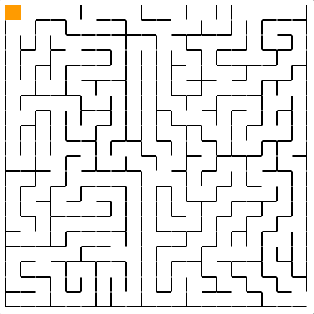

# Welcome To Machine Colony Frontend Code test
This is the frontend code test repo for Machine Colony Code Interview. Have Fun and Good Luck!

## How to submit your code
1. fork this repo under your github account
2. finish the code test
3. send us your repo :)

## Subject
please check the `index.html` in the repo and finish the following tasks:

1. put a 'mouse' into the entrance of the maze and you can use `left, right, up, down` key in the keyboard to control it (the mouse can't go across the wall)

2. write the code to find the right path in the maze automatically and add the animation when finding the path

These two tasks are indepentant, please submit your answer separately.

## Contact Us
if you have any questions about the code test, please contact me aaron@machinecolony.com

## what is the result look like:
### Task one

### Task two

